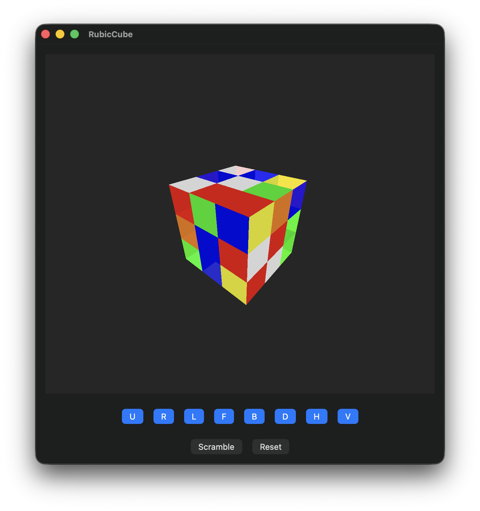

# RubicCube

A 3D Rubik's Cube simulator and solver built with SwiftUI and Metal for iOS and macOS.



## Features

- **3D Visualization**: Real-time 3D rendering using Metal shaders
- **Interactive Controls**: Manual cube manipulation with standard notation (U, R, L, F, B, D, H, V)
- **Scrambling**: Random cube scrambling with configurable move count
- **Smooth Animations**: Fluid rotation animations for all cube moves
- **Cross-Platform**: Supports both iOS 17+ and macOS 15+

## Architecture

The project follows a clean architecture pattern with three main components that work together to provide a smooth, interactive 3D Rubik's Cube experience:

```
┌──────────────────┐      ┌──────────────────┐      ┌───────────────────┐
│  Solver Module   │───►──│  Animation Queue │───►──│    Renderer       │
│  (CPU – Swift)   │      │  (Swift)         │      │  (GPU – Metal)    │
└──────────────────┘      └──────────────────┘      └───────────────────┘
         ▲                          ▲                         ▲
         │                          │                         │
         │                          └─── Model (CubeState) ───┘
         │                                       │
         └────────── User Input/UI ──────────────┘
```

### Core Components

#### 1. Solver Module (CPU - Swift)
The brain of the application that handles all cube logic and state management:

- **`RubicCubeSolver`**: Core solver class implementing the `Solver` protocol
  - Manages cube state through a `Cube` instance
  - Applies moves using 3D rotation mathematics with SIMD vectors
  - Updates cubie positions, orientations, and face colors
  - Supports debug mode for move validation and logging

- **`Cube` Model**: Represents the 3D cube state
  - Contains 27 `Cubie` objects in a 3x3x3 grid
  - Each cubie stores position, transform matrix, and face colors
  - Uses `RotatableGrid3D` for efficient 3D array operations
  - Maintains both current and original positions for state tracking

- **`Move` System**: Defines cube rotations
  - Axis-based rotations (X, Y, Z)
  - Layer specification (0-2 for each axis)
  - Direction control (clockwise/counter-clockwise)
  - Mathematical rotation matrices for precise 3D transformations

#### 2. Animation Queue (Swift)
Manages smooth transitions and user experience:

- **`CubeAnimator`**: Handles move animations
  - Interpolates between cube states over time
  - Provides smooth rotation transitions
  - Manages animation timing and completion callbacks
  - Supports configurable animation speeds

- **`RubiksCubeViewModel`**: Coordinates the entire system
  - Manages move queue and animation pipeline
  - Handles user input and button interactions
  - Controls display link for 60fps rendering
  - Implements scrambling algorithms with move validation
  - Bridges between UI and core logic

- **Display Link Integration**: Ensures smooth 60fps updates
  - Uses `CADisplayLink` for frame-perfect timing
  - Processes animation frames and applies completed moves
  - Triggers UI updates through `@Published` properties

#### 3. Metal Renderer (GPU)
High-performance 3D visualization:

- **`RubiksCubeMetalView`**: Metal-based 3D rendering
  - Custom Metal shaders for cube visualization
  - Real-time 3D transformations and lighting
  - Efficient GPU-based rendering pipeline
  - Support for both iOS and macOS Metal APIs

- **Shader System**: Custom Metal shaders
  - Vertex shaders for 3D transformations
  - Fragment shaders for lighting and coloring
  - Optimized for mobile and desktop GPUs
  - Handles 27 cubies with individual transforms

- **3D Mathematics**: SIMD-based calculations
  - Uses `simd_float4x4` matrices for transformations
  - Efficient vector operations for rotations
  - Precise 3D positioning and orientation
  - Cross-platform mathematical consistency

#### 4. SwiftUI Interface
Modern, responsive user interface:

- **`ContentView`**: Main application interface
  - Clean, intuitive button layout
  - Real-time cube visualization
  - Responsive design for different screen sizes
  - Accessibility support built-in

- **State Management**: Reactive UI updates
  - `@StateObject` for view model binding
  - Automatic UI updates on cube state changes
  - Smooth integration with animation system
  - Cross-platform UI consistency

### Data Flow

1. **User Input**: Button presses trigger move enqueueing
2. **Move Processing**: Animation queue processes moves sequentially
3. **State Updates**: Solver applies completed moves to cube state
4. **Rendering**: Metal renderer displays updated cube in 3D
5. **UI Refresh**: SwiftUI updates interface based on new state

### Key Design Patterns

- **Protocol-Oriented Programming**: `Solver` protocol for extensibility
- **MVVM Architecture**: Clear separation between view and business logic
- **Dependency Injection**: Solver and animator injected into view model
- **Reactive Programming**: Combine framework for state management
- **Resource Management**: Efficient Metal resource handling

## Requirements

- iOS 17.0+ / macOS 15.0+
- Xcode 15.0+
- Swift 6.1+

## Installation

### Swift Package Manager

Add the following to your `Package.swift` file:

```swift
dependencies: [
    .package(url: "https://github.com/yourusername/RubicCube.git", from: "1.0.0")
]
```

### Manual Installation

1. Clone the repository:
```bash
git clone https://github.com/yourusername/RubicCube.git
```

2. Open `RubicCube.xcworkspace` in Xcode
3. Build and run the project

## Usage

### Basic Controls

- **U, R, L, F, B, D**: Standard Rubik's cube face rotations
- **H, V**: Horizontal and vertical middle layer rotations
- **Scramble**: Randomly scrambles the cube with 20 moves
- **Reset**: Returns the cube to solved state

### Integration

To use RubicCube in your own project:

```swift
import SwiftUI
import RubicCubeSolver

struct MyView: View {
    var body: some View {
        ContentView()
    }
}
```

## Project Structure

```
Sources/RubicCubeSolver/
├── Animators/           # Animation system
├── Helpers/            # Utility functions
├── Shaders/            # Metal shader files
├── Solver/             # Core cube logic
│   ├── Model/          # Data structures
│   └── RubicCubeSolver.swift
└── View/               # SwiftUI components
```

## Technical Details

### Cube Representation

The cube is represented as a 3x3x3 grid of 27 cubies, each containing:
- Position and orientation transforms
- Face color information
- Original position tracking

### Move System

Moves are defined by:
- **Axis**: X, Y, or Z rotation axis
- **Layer**: Which layer to rotate (0-2)
- **Direction**: Clockwise or counter-clockwise

### Rendering Pipeline

1. **CPU**: Move calculation and state updates
2. **Animation**: Smooth interpolation between states
3. **GPU**: Metal shader-based 3D rendering

## Contributing

1. Fork the repository
2. Create a feature branch (`git checkout -b feature/amazing-feature`)
3. Commit your changes (`git commit -m 'Add some amazing feature'`)
4. Push to the branch (`git push origin feature/amazing-feature`)
5. Open a Pull Request

## License

This project is licensed under the MIT License - see the [LICENSE](LICENSE) file for details.

## Acknowledgments

- Built with SwiftUI and Metal
- Inspired by classic Rubik's Cube mechanics
- Thanks to the Swift community for excellent documentation and examples
